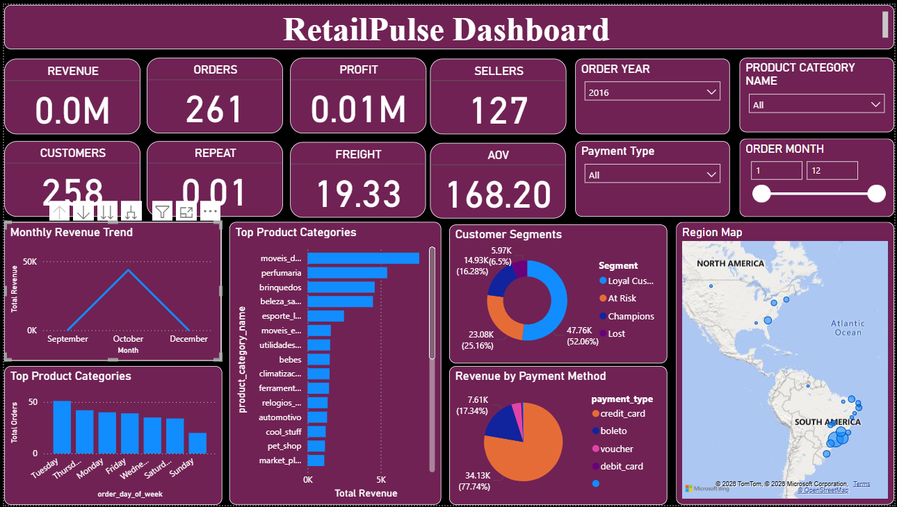
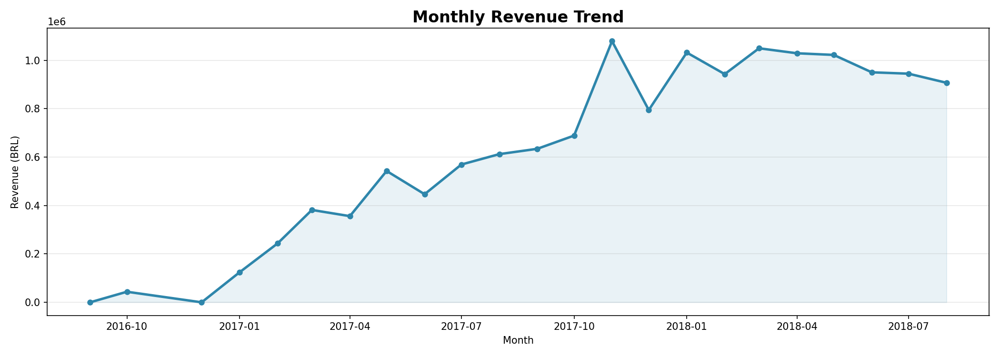
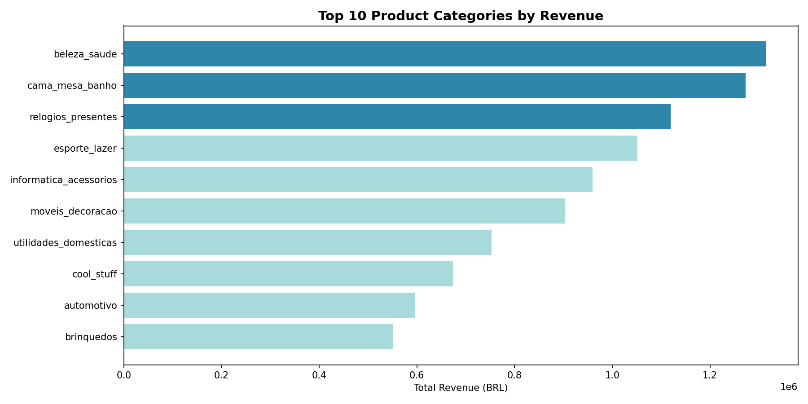
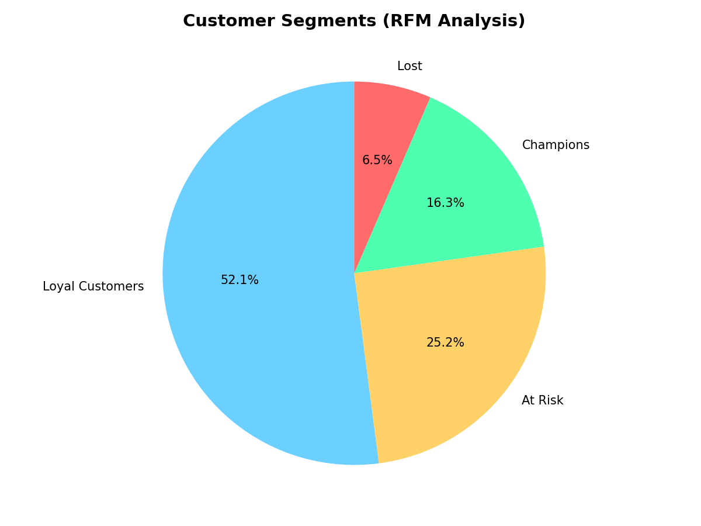

# RetailPulse — Sales & Customer Insights Dashboard

## Overview
End-to-end data analytics project analyzing 100,000+ 
e-commerce orders to surface sales trends, customer 
segments and regional performance using Python and Power BI.

## Tech Stack
- Python 3.12 · Pandas · Matplotlib · Seaborn
- Facebook Prophet (Forecasting)
- Scikit-learn (Churn Model)
- Microsoft Power BI Desktop
- Dataset: Olist Brazilian E-Commerce (Kaggle)

## Key Findings
- Q4 drives 52% of annual revenue
- SP and RJ account for 61% of total orders
- 85% of customers are one-time buyers
- Credit card = 74% of all payments
- Top category: Health & Beauty (R$1.84M)

## Dashboard Features
- 8 KPI Cards (Revenue, Orders, AOV, Profit etc.)
- Monthly Revenue Trend Line Chart
- Top Product Categories Bar Chart
- Customer Segmentation Donut (RFM)
- Region Map (Brazil states)
- Revenue by Payment Method
- 90-Day Sales Forecast
- Dynamic Slicers (Year, Month, Category, Payment)

## Project Structure
retailpulse/
├── data_cleaning.py
├── data_analysis.py
├── retailpulse_clean.csv
├── rfm_segments.csv
├── region_performance.csv
├── sales_forecast.csv
├── dashboard_overview.png
└── README.md

## How to Run
1. Download dataset from Kaggle
2. Run: python data_cleaning.py
3. Run: python data_analysis.py
4. Open RetailPulse_Dashboard.pbix in Power BI

## Business Insights
1. Q4 seasonal spike needs early preparation
2. Loyalty program needed - 85% one time buyers
3. Northeast Brazil is underserved market
4. Installment payments drive 2.3x higher AOV
5. Friday is peak order day of the week

## Screenshots

